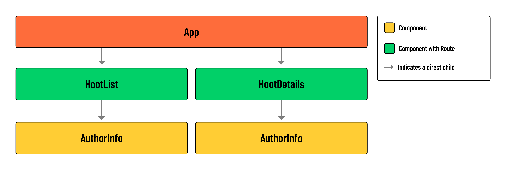

<h1>
  <span class="headline">Hoot Front-End</span>
  <span class="subhead">Build a Reusable Metadata Component</span>
</h1>

**Learning objective:** By the end of this lesson, students will be able to build a reusable metadata component.

## Overview

In this lesson, we'll build a reusable metadata component called `AuthorInfo`.

The term 'metadata' refers to data that provides information about other data. In the context of online content such as blog posts or comments, metadata will often include information on the content's author, such as their name and the date the content was created.

Throughout our application, we are currently rendering this information with a `<p>` tag:

```jsx
<p>
  {`${hoot.author.username} posted on
  ${new Date(hoot.createdAt).toLocaleDateString()}`}
</p>
```

Our `AuthorInfo` component will replace this `<p>` tag with a more refined layout and styling. This will make it easier to display information about an author in a visually consistent manner across the app.

Both `hoots` and `comments` will be able to use the `AuthorInfo` component. As a result, `AuthorInfo` is built to receive a generic `content` prop so as not to mislabel either of these resources.

The `AuthorInfo` component will also display the `createdAt` property of a resource and a `ProfileIcon` image representing the author.

Take a look at the component hierarchy diagram below for context on how `AuthorInfo` fits into our component tree:



> 💡 In the `HootList` component, an instance of `AuthorInfo` will be produced for each `hoot` as we `map()` over the `hoots` array. The same will apply to the `hoot.comments` rendered inside of the `HootDetails` component. A stand-alone instance of `AuthorInfo` will also be rendered at the top of `HootDetails`, alongside details of a single `hoot`.

## Build the component

Let's build the component!

Run the following commands in your terminal:

```bash
mkdir src/components/AuthorInfo
touch src/components/AuthorInfo/AuthorInfo.jsx
touch src/components/AuthorInfo/AuthorInfo.module.css
```

Add the following to the new CSS module file:

```css
/* src/components/AuthorInfo/AuthorInfo.module.css */

.container {
  display: flex;
  align-items: center;
  justify-content: flex-start;
}

.container * {
  margin: 0;
}

.container div {
  margin: 0 !important;
}

.container > img {
  width: 30px;
  height: 30px;
  object-fit: cover;
  margin-right: 12px;
  border-radius: 50%;
  background-color: var(--background);
}

.container section > p {
  opacity: 0.75;
  line-height: 1;
  font-size: 14px;
  font-weight: bold;
  margin-bottom: 2px;
}

.container div p {
  line-height: 0.8;
  font-size: 11px;
  font-weight: 600;
  letter-spacing: 1px;
}

.container section {
  display: flex;
  flex-direction: column;
}

.container section img {
  opacity: 0.5;
  width: 14px;
  height: 14px;
  background: none;
  margin: 0 2px 0 -2px;
}
```

Add the following to the new `AuthorInfo` component:

```jsx
// src/components/AuthorInfo/AuthorInfo.jsx

import styles from './AuthorInfo.module.css';
import ProfileIcon from '../../assets/images/profile.png';
import Icon from '../Icon/Icon';

const AuthorInfo = ({ content }) => {
  return (
    <div className={styles.container}>
      
      <section>
        <p>{content.author.username}</p>
        <div className={styles.container}>
          <Icon category='Calendar' />
          <p>{new Date(content.createdAt).toLocaleDateString()}</p>
        </div>
      </section>
    </div>
  );
};

export default AuthorInfo;
```

> 💡 Because our application does not include photo upload, we'll make use of a generic `ProfileIcon` SVG in place of a profile picture.

## Apply the metadata component

Add the following import to `src/components/HootList/HootList.jsx`:

```jsx
import AuthorInfo from '../../components/AuthorInfo/AuthorInfo';
```

In `src/components/HootList/HootList.jsx`, locate the following `<p>` tag:

```jsx
// src/components/HootList/HootList.jsx

<p>
  {hoot.author.username} posted on
  {new Date(hoot.createdAt).toLocaleDateString()}
</p>

</header>
<p>{hoot.text}</p>
```

Replace this tag with the `<AuthorInfo />` component, passing down `content={hoot}`:

```jsx
// src/components/HootList/HootList.jsx

  <AuthorInfo content={hoot} />
</header>
<p>{hoot.text}</p>
```

Add the following import to the `HootDetails` component:

```jsx
// src/components/HootDetails/HootDetails.jsx

import AuthorInfo from '../../components/AuthorInfo/AuthorInfo';
```

Locate the existing `<p>` tag this component:

```jsx
// src/components/HootDetails/HootDetails.jsx

<p>
  {`${hoot.author.username} posted on
  ${new Date(hoot.createdAt).toLocaleDateString()}`}
</p>
```

And replace this tag with the `<AuthorInfo />` component, passing down `content={hoot}`:

```jsx
// src/components/HootDetails/HootDetails.jsx

<header>
  <p>{hoot.category.toUpperCase()}</p>
  <h1>{hoot.title}</h1>
  <div>
    <AuthorInfo content={hoot} />
    {hoot.author._id === user._id && (
      <>
        <Link to={`/hoots/${hootId}/edit`}>
          <Icon category='Edit' />
        </Link>
        <button onClick={() => props.handleDeleteHoot(hootId)}>
          <Icon category='Trash' />
        </button>
      </>
    )}
  </div>
</header>
```

Notice how we label `hoot` as `content` when passing props to `<AuthorInfo>`. We do this because we'll reuse the `AuthorInfo` component for our comments as well. Thankfully, the shape of a `hoot` and `comment` are similar enough that we don't need to adjust any code inside the `AuthorInfo` component. By mapping `hoot` and a `comment` to a generic `content` prop, we avoid misrepresenting the data type or data source used in the component.

Next, we can add the `<AuthorInfo />` component to our list of comments, replacing the existing `<p>` tag.

Update the `HootDetails` component as shown below:

```jsx
// src/components/HootDetails/HootDetails.jsx

{
  hoot.comments.map((comment) => (
    <article key={comment._id}>
      <header>
        <div>
          <AuthorInfo content={comment} />
          {comment.author._id === user._id && (
            <>
              <Link to={`/hoots/${hootId}/comments/${comment._id}/edit`}>
                <Icon category='Edit' />
              </Link>
              <button onClick={() => handleDeleteComment(comment._id)}>
                <Icon category='Trash' />
              </button>
            </>
          )}
        </div>
      </header>
      <p>{comment.text}</p>
    </article>
  ));
}
```

Check out the changes we made in your browser. You should now have a fully developed application.

Congratulations! You've reached the end of this code-along!
